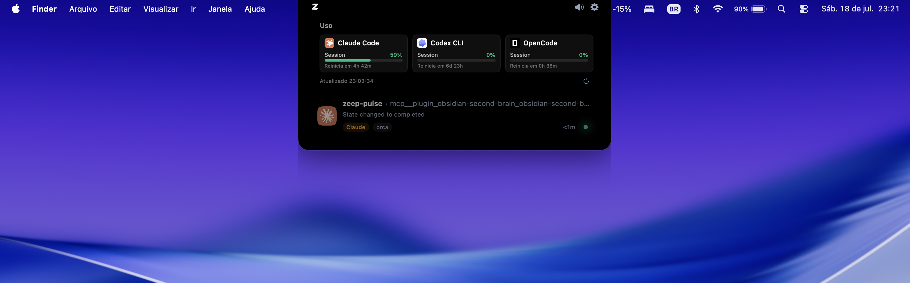

# Zeep Pulse

**A macOS notch panel for your AI coding agents — see what Claude Code, Codex, and OpenCode are doing without leaving your terminal.**

Zeep Pulse turns the MacBook notch into a live control surface for local AI coding agents. Every session's status shows up right there — working, waiting for approval, asking a question, done — so you're not tabbing between terminal windows to find out which agent needs you.

## Install

**Free, no account, no subscription.** Download the latest signed, notarized build from **[Releases](https://github.com/zeeplabs/zeep-pulse-macos/releases/latest)**.

The app auto-updates itself after that (Sparkle) — no need to come back here for future versions.

---

## Why Zeep Pulse

- **Live session status in the notch** — every running agent visible at a glance: working, waiting for approval, waiting for an answer, reviewing a plan, done, failed, disconnected
- **Approve from the notch** — permission requests (file edits, shell commands) show up as cards right there; allow, deny, or always-allow without switching windows
- **Answer questions in one click** — when an agent asks you to pick an option, answer from the panel and it types the response into the real terminal for you
- **Jump back to the exact terminal tab** — not just "bring the app forward" — lands on the specific tab/session that needs you (Terminal.app, iTerm2, Orca)
- **Usage limits at a glance** — track each agent's session/weekly quota right from the notch and the menu bar popover, so you see how close you are to a rate limit before it hits
- **Menu bar + notch** — quick popover with all active sessions, or the full notch overlay
- **Local-first, zero telemetry** — no source code, prompts, or agent output ever leaves your Mac. No analytics, no crash reporting, no network calls beyond the update check.
- **Native Swift, not Electron** — small footprint, low idle CPU

## Supported agents

Claude Code · Codex · OpenCode

## Supported terminals

Terminal.app · iTerm2 · Orca · Wave (best-effort) — plus generic app-activation for Ghostty, Warp, Kitty, VS Code, and Cursor

---

## This repository

This repo hosts **public release binaries and the Sparkle update feed only** — the app's source lives in a private repo. If something's broken or missing, this is still the right place to say so.

### Report a bug or request a feature

[**Open an issue →**](https://github.com/zeeplabs/zeep-pulse-macos/issues/new)

Include your Zeep Pulse version, macOS version, and which agent/terminal you were using.

## Privacy

Zeep Pulse is local-first by design: session data, prompts, and agent output stay in Core Data on your machine. The only outbound network call the app makes is the periodic Sparkle update check.

## License

Copyright © 2026 Zeep Tecnologia. All rights reserved.

---

*Built in Brazil by ZeepLabs.*
